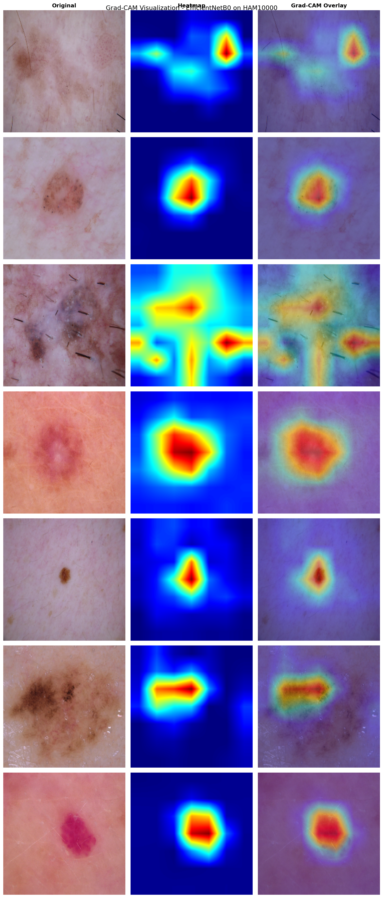
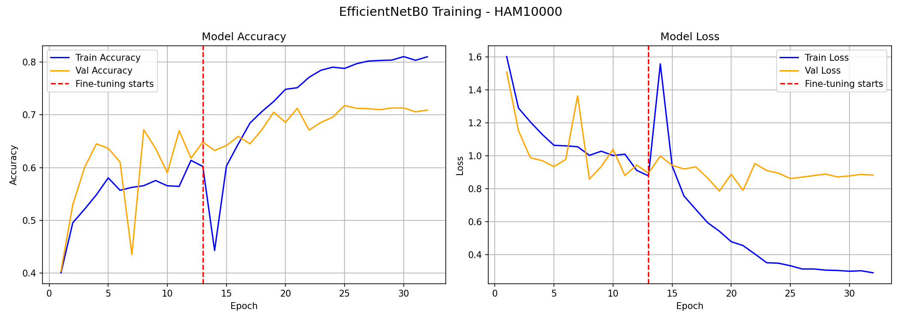
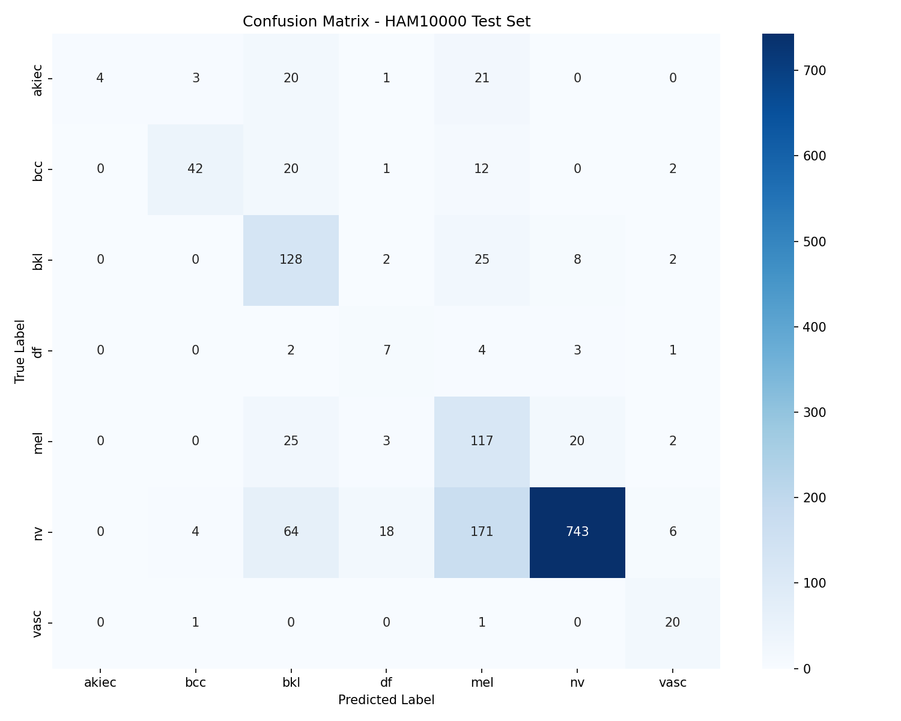

# Skin Cancer Detection using Deep Learning

A skin lesion classifier built on EfficientNetB0, trained on the HAM10000 
dermoscopy dataset. The model classifies lesions into 7 categories and uses 
Grad-CAM to visually explain its predictions.

## Results

| Metric | Value |
|--------|-------|
| Test Accuracy | 72% |
| Macro F1 Score | 0.58 |
| Weighted F1 Score | 0.74 |
| Best performing class | nv (F1: 0.84) |
| Most challenging class | akiec (F1: 0.18) |

> Weighted accuracy is high due to class imbalance (nv = 67% of dataset).
> Macro F1 (0.58) is the more honest metric for imbalanced classification.

## Per-Class Performance

| Class | Description | Precision | Recall | F1 |
|-------|-------------|-----------|--------|----|
| akiec | Actinic Keratoses | 0.83 | 0.10 | 0.18 |
| bcc | Basal Cell Carcinoma | 0.76 | 0.69 | 0.72 |
| bkl | Benign Keratosis | 0.46 | 0.72 | 0.57 |
| df | Dermatofibroma | 0.41 | 0.65 | 0.50 |
| mel | Melanoma | 0.38 | 0.77 | 0.50 |
| nv | Melanocytic Nevi | 0.96 | 0.74 | 0.84 |
| vasc | Vascular Lesions | 0.58 | 0.95 | 0.72 |

## Visualizations

### Grad-CAM — Model Explainability


### Training Curves


### Confusion Matrix


## Model Architecture

- **Backbone**: EfficientNetB0 pretrained on ImageNet
- **Training strategy**: Two-phase fine-tuning
  - Phase 1: Frozen base, train classification head only (15 epochs)
  - Phase 2: Full model fine-tuning at lower learning rate (25 epochs)
- **Imbalance handling**: Class weights (not oversampling)
- **Augmentation**: Rotation, flips, zoom, shifts
- **Input size**: 224x224 RGB

## Dataset

[HAM10000 - Human Against Machine with 10000 training images](https://www.kaggle.com/datasets/kmader/skin-cancer-mnist-ham10000)

- 10,015 dermoscopy images
- 7 diagnostic categories
- Significant class imbalance (nv: 6705 vs df: 115)

## Project Structure

```
skin-cancer-detector/
├── training/          # Kaggle training notebook
├── model/             # Model weights (not tracked by git)
├── results/
│   ├── plots/         # Training curves, confusion matrix
│   ├── gradcam/       # Grad-CAM visualizations
│   └── metrics/       # Classification report, training history
├── app/               # Flask web application
│   ├── app.py
│   ├── templates/
│   └── static/
├── notebooks/         # EDA and experiments
├── requirements.txt
└── README.md
```

## Known Limitations

- akiec recall is 0.10 — model misses 90% of precancerous lesions
- mel recall is 0.77 — misses 23% of melanoma cases
- Performance gap between majority and minority classes reflects 
  dataset imbalance that class weights alone cannot fully resolve
- Not validated on external datasets — not suitable for clinical use

## How to Run Locally

```bash
# Clone the repo
git clone https://github.com/shashaank-pendyala/skin-cancer-detector.git
cd skin-cancer-detector

# Install dependencies
pip install -r requirements.txt

# Run the app
cd app
python app.py
```

## Tech Stack

- Python 3.12
- TensorFlow 2.19 / Keras
- EfficientNetB0 (ImageNet pretrained)
- Flask
- OpenCV (Grad-CAM)
- scikit-learn (evaluation metrics)